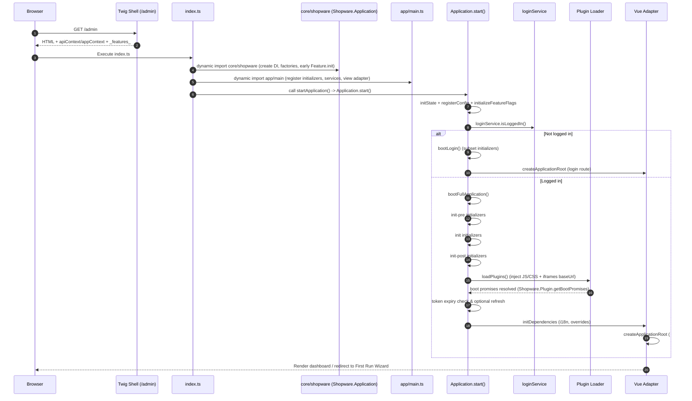

## Headless Architecture

The Shopware 6 Administration is a purely client-rendered single-page application (SPA). After the initial HTML shell (Twig template) is delivered, *all* subsequent UI rendering, routing and data updates occur client-side. There is no server-driven HTML diffing or SSR fallback, an intentional design choice because the Vue components are built in the client from the Component Factory to allow component customization from plugins.

## Why Headless for the Administration?

| Goal | Headless Benefit |
|------|------------------|
| Extensibility | Dynamic runtime injection (plugins) & remote iframes (apps) |
| Consistency | Unified client data abstraction (Repository + Criteria) across all domains |
| Iteration Speed | UI deploy cycles decoupled from heavy backend template changes |
| Isolation of Concerns | Backend focuses on API correctness; frontend handles presentation/state orchestration |

## High-Level Boot & Render Sequence

The actual sequence (simplified) derived from `index.ts`, `core/shopware.ts`, `app/main.ts`, and `core/application.ts`:

1. Browser requests `/admin` → Twig shell responds with minimal HTML + injected `apiContext` & `appContext` (incl. bundles metadata). If a global `_features_` object is present it is consumed immediately in `core/shopware.ts` for an early `Feature.init` before the formal `Application.start()` sequence.
2. `index.ts` loads global styles, dynamically imports `core/shopware` (creates Bottle DI container, factories, global `Shopware` object, early feature init if `_features_` present).
3. `index.ts` then dynamically imports `app/main.ts` which:
   * Registers pre-initializers (`init-pre`: `apiServices`, `state`, `store`).
   * Registers main initializers (`init`: router, http client, repository factory, locale, base components, directives, filters, core module routes, context, shortcuts, etc.).
   * Registers post-initializers (`init-post`: language loader, user information, worker, usage-data).
   * Registers many service providers (feature, loginService, menuService, privileges, acl, entityMapping, etc.).
   * Creates & assigns the view adapter (VueAdapter) to `Application`.
4. `index.ts` calls `window.startApplication()` (mapped to `Shopware.Application.start(config)` by the shell) passing runtime contexts.
5. `Application.start()`:
    * `initState()` ensures pre-initializer state container exists.
    * `registerConfig()` sets `Shopware.Context.api` & `Shopware.Context.app`.
    * `initializeFeatureFlags()` (re)initializes feature flags from `Context.app.features` (may refine the earlier `_features_` seed).
    * `startBootProcess()` checks authentication state and bearer token expiry; if token is close to expiring (<5s) it refreshes immediately, otherwise schedules auto refresh, then chooses login or full boot.
6. If not logged in → `bootLogin()` initializes only a reduced initializer set (login, base components, locale, core directives, apiServices, store) then mounts the login route. (The router is still required for mounting; although not in the reduced whitelist, it is implicitly available by the time the root is created.)
7. If logged in → `bootFullApplication()` executes in order:
   * Initialize all `init-pre` initializers.
   * Initialize all `init` initializers.
   * Initialize all `init-post` initializers.
   * `loadPlugins()` fetches & injects plugin/app bundles (prioritizing commercial bundle), dynamically injecting JS/CSS and registering components/routes/services.
   * Await `Shopware.Plugin.getBootPromises()` (async plugin boot tasks).
   * Initialize view adapter dependencies (i18n, component overrides, etc.).
   * Create and mount Vue root (`view.init('#app', router, serviceContainer)`).
   * Redirect into First Run Wizard if conditions match.
8. Post-mount, navigation loads additional module chunks lazily. Plugin/App iframes for bundles declaring a `baseUrl` are actually injected during `loadPlugins()` (boot phase) rather than deferred strictly until first navigation; their contained application features still become relevant only when related routes/components are visited.

See detailed breakdown in: [Boot Process](../02-architecture/01-boot-process.md).

## Shell & Runtime Configuration

The Twig shell (`src/Administration/Resources/views/administration/index.html.twig`) is a almost static twig file which boots up the SPA. It injects minimal dynamic values (e.g. API base URL, asset paths, potentially build hash, locale) needed for the application. Everything else (features, permissions, modules) resolves after JavaScript loads.

## Routing & Navigation

* Vue Router (hash mode): URLs reflect logical modules and entity views
* Route guards enforce authentication & privilege checks before component mount
* Lazy loaded code for components reduce initial payload

## Communication Channels

| Channel | Purpose | Notes |
|---------|---------|-------|
| REST (HTTP/JSON) | Primary data read/write | Wrapped by Repository pattern; Criteria optimizes payloads |
| iFrame postMessage (App Bridge) | Remote App integration | Permission-scoped APIs for navigation, entity access, UI actions |
| Websocket | Message Queue updates | Real time notifications (e.g. background task completion) |

Fallback strategies: if realtime unavailable, polling intervals or manual refresh actions in specific modules.

## Data Retrieval Flow

1. Component requests data (`repository.search(criteria)`)
2. Criteria shapes filters, pagination, association loads, field selection
3. REST call executed; response normalized to entity schema definitions
4. Component receives reactive collection / entities

Advanced topics (covered in [Data Layer Overview](../04-data-layer/01-overview.md)):

* Partial database association loading vs over-fetching trade-offs
* Draft mutation before persistence
* Handling translated fields and fallback resolution

## State & Side Effects

The Administration progressively migrated toward more granular state stores rather than a monolithic global store. Patterns include:
 
* Module-local reactive state / composables for domain-specific UI state
* Service container for cross-cutting concerns (repository factory, feature service, acl service)
* Minimal global stores for user session, language, and privilege sets
* Feature flags gating feature store registration (see [Feature Flags & Deprecations](../05-runtime/02-feature-flags-deprecations.md))

## Authentication & Context

* Initial unauthenticated load may redirect to login route
* After login: bearer token stored (session) → appended to API requests
* Context objects (languageId, system languageId, sales channel id where applicable) propagate through repository criteria so translations & scoping remain consistent
* Periodic token refresh prevents silent expiry; on failure triggers re-auth flow

## Security Layers

| Layer | Responsibility | Notes |
|-------|----------------|-------|
| ACL Service | Privilege presence checks before route/component usage | Mirrors server enforcement |
| App Bridge Permissions | Restrict remote app operations | Manifest-defined scopes |
| Iframe Isolation | Contain remote apps | postMessage only communication |

Deep dive: [ACL & Permissions](../09-security/01-acl-permissions.md), [App Iframe Security](../09-security/02-app-iframe-security.md).

## Performance Considerations

| Concern | Impact | Mitigation |
|---------|--------|------------|
| Initial Bundle Size | Affects first paint time | Code splitting by module, async locale/snippet loading |
| Over-fetching Associations | Increases response payload | Targeted Criteria with `addAssociation` only where necessary |
| Extension Injection Cost | Startup delay | Lazy component registration where possible, feature flag pruning |
| Heavy Lists (e.g. products) | UI jank & memory | Pagination |

Further detail: [Performance Overview](../10-performance/01-overview.md) and [Code Splitting](../10-performance/02-code-splitting.md).

## Trade-offs of the Headless SPA Choice

Pros:

* Clear separation of presentation and backend concerns
* Interactive app without reloads on navigation
* Flexible extension lifecycle (dynamic injection / remote apps)

Cons / Costs:

* Larger initial download (JS/CSS) vs incremental server rendering
* No SSR → slower First Contentful Paint on low-end devices / slow networks
* Offline use is not possible
* SEO not applicable (admin is not public-facing)
