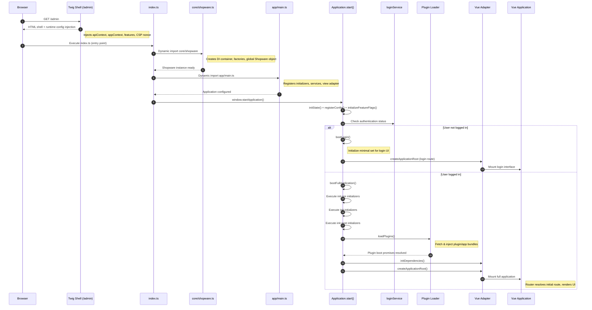

# Boot Process

The Shopware 6 Administration is a single-page application (SPA) that follows a boot sequence to initialize the JavaScript application, manage authentication, load plugins, and render the Vue.js interface. This document outlines the complete boot process from initial browser request to fully rendered application.

## Boot Sequence Overview



## Phase 1: Twig Shell Rendering

The boot process begins when a user requests the administration URL (`/admin`). The server renders a minimal HTML shell using the Twig template located at:
- `src/Administration/Resources/views/administration/layout/base.html.twig` (base layout)
- `src/Administration/Resources/views/administration/index.html.twig` (main template)

### Runtime Configuration Injection

The Twig template injects critical runtime configuration into the HTML:

```javascript
// Feature flags for early initialization
window._features_ = {{ features|json_encode|raw }};

// Global asset configuration
window.__sw__ = {
    assetPath: '{{ asset('', 'asset') }}',
};

// Application startup function with runtime contexts
window.startApplication = () => {
    Shopware.Application.start({
        apiContext: {
            host: '{{ app.request.host }}',
            port: {{ app.request.port }},
            scheme: '{{ app.request.scheme }}',
            // ... additional API configuration
        },
        appContext: {
            features: window._features_,
            firstRunWizard: {{ firstRunWizard ? 'true' : 'false' }},
            // ... additional app configuration
        }
    });
};
```

### Bundle Loading

The template uses Vite's asset system to load JavaScript bundles:
- `{{ vite_entry_link_tags('app') }}` - CSS assets
- `{{ vite_entry_script_tags('administration', { attr: { nonce: cspNonce } }) }}` - JavaScript bundles

## Phase 2: JavaScript Entry Point

The main entry point is `src/Administration/Resources/app/administration/src/index.ts`:

```typescript
// Import global styles
import './app/assets/scss/all.scss';

// Dynamic import of core Shopware instance
void import('src/core/shopware').then(async ({ ShopwareInstance }) => {
    // Set global Shopware instance
    window.Shopware = ShopwareInstance;

    // Handle login overrides if present
    if (window._swLoginOverrides) {
        window._swLoginOverrides.forEach((script) => script());
    }

    // Import main application configuration
    await import('src/app/main');

    // Start the application
    window.startApplication();
});
```

## Phase 3: Core System Initialization

### Dependency Injection Container Setup

The `src/core/shopware.ts` file creates the foundation:

1. **Early Feature Flag Initialization**: If `window._features_` exists, feature flags are initialized immediately
2. **Bottle.js DI Container**: Creates the main dependency injection container with strict mode disabled
3. **Application Bootstrapper**: Instantiates the main application bootstrapper
4. **Factory Registration**: Registers all core factories (component, template, module, state, etc.)
5. **Global Shopware Object**: Creates the global `Shopware` object with all APIs

### Factory Registration

Key factories registered include:
- `component` - AsyncComponentFactory for dynamic component loading
- `template` - TemplateFactory for template management
- `module` - ModuleFactory for module registration
- `state` - StateFactory for state management
- `serviceFactory` - ServiceFactory for service creation
- `mixin`, `filter`, `directive` - Various Vue.js extensions
- `plugin` - PluginBootFactory for plugin system
- `apiService` - ApiServiceFactory for API services

## Phase 4: Application Configuration

The `src/app/main.ts` file configures the application:

### Initializer Registration

Three types of initializers are registered in order:

1. **Pre-initializers** (`init-pre`): Core system setup
   - `state` - Application state initialization
   - API services and factories

2. **Main initializers** (`init`): Core application features
   - `httpClient` - HTTP client setup
   - `repositoryFactory` - Data layer initialization
   - `router` - Vue Router setup
   - `locale` - Internationalization
   - `baseComponents` - Core Vue components
   - `coreModuleRoutes` - Module routing
   - `context` - Application context
   - `shortcut` - Keyboard shortcuts

3. **Post-initializers** (`init-post`): Extended features
   - Language loading
   - User information
   - Background workers
   - Usage data collection

### Service Provider Registration

Critical services are registered:
- `featureService` - Feature flag management
- `loginService` - Authentication and token management
- `menuService` - Navigation menu
- `acl` - Access control
- `repositoryFactory` - Data repository pattern
- `validationService` - Form validation
- Many domain-specific services

### Vue Adapter Setup

Creates and assigns the Vue.js adapter (`VueAdapter`) to handle the view layer.

## Phase 5: Application Start Sequence

When `window.startApplication()` is called, it triggers `Shopware.Application.start()`:

### Initial Setup
1. **State Initialization**: `initState()` ensures the pre-initializer state container exists
2. **Configuration Registration**: `registerConfig()` sets up `Shopware.Context.api` and `Shopware.Context.app`
3. **Feature Flag Initialization**: `initializeFeatureFlags()` processes feature flags from context

### Authentication Check

The `startBootProcess()` method determines the boot path:

```typescript
// Check if user is logged in
if (!loginService.isLoggedIn()) {
    loginService.logout(false, false);
    return this.bootLogin();
}

// Check token expiry
const expiry = loginService.getBearerAuthentication('expiry');
if (expiry < Date.now() + 5000) {
    // Token expires within 5 seconds - refresh it
    await loginService.refreshToken();
} else {
    // Start auto token refresh
    loginService.restartAutoTokenRefresh(expiry);
}

return this.bootFullApplication();
```

## Phase 6A: Login Boot (Unauthenticated)

For unauthenticated users, `bootLogin()` executes:

1. **Reduced Initializer Set**: Only login-essential initializers run
2. **View Dependencies**: Initialize minimal Vue adapter dependencies  
3. **Application Root**: Create and mount Vue application with login route
4. **Session Flag**: Set `sw-login-should-reload` for post-login refresh

The login interface is rendered with minimal functionality until authentication succeeds.

## Phase 6B: Full Application Boot (Authenticated)

For authenticated users, `bootFullApplication()` executes the complete sequence:

### Initializer Execution
```typescript
return this.initializeInitializers(initPreContainer, '-pre')
    .then(() => this.initializeInitializers(initContainer))
    .then(() => this.initializeInitializers(initPostContainer, '-post'))
    .then(() => this.loadPlugins())
    .then(() => Promise.all(Shopware.Plugin.getBootPromises()))
    .then(() => this.view.initDependencies())
    .then(() => this.createApplicationRoot())
```

### Plugin Loading

The `loadPlugins()` method:
1. Fetches plugin/app bundle metadata from API
2. Prioritizes commercial bundles for loading order
3. Dynamically injects CSS and JavaScript files
4. Creates iframe containers for apps with `baseUrl`
5. Registers plugin components, routes, and services
6. Handles Hot Module Replacement (HMR) in development

### Vue Application Creation

The `createApplicationRoot()` method:
1. Gets the router instance from initializers
2. Calls `view.init('#app', router, serviceContainer)`
3. Handles First Run Wizard redirection if needed
4. Resolves the `viewInitialized` promise for dependent code

## Phase 7: Vue Adapter Initialization

The `VueAdapter.init()` method creates the Vue.js application:

### Vue App Setup
```typescript
// Create Vue app with root component
this.app = createApp({
    name: 'ShopwareAdministration',
    template: '<sw-admin />',
});
```

### Plugin and Extension Registration
1. **Vue Plugins**: Registers Vue.js plugins
2. **Directives**: Registers custom Vue directives  
3. **I18n Setup**: Configures internationalization with fallback handling
4. **Router Integration**: Adds Vue Router
5. **State Management**: Integrates Vuex store
6. **Global Properties**: Sets up `$t`, `$tc` translation functions
7. **Service Injection**: Makes services available to components

### Component Synchronization

Critical components are marked as synchronous for immediate availability:
- `sw-admin` - Root administration component
- `sw-admin-menu` - Main navigation
- `sw-button`, `sw-button-process` - Core UI elements
- Various form and layout components

### Application Mount

Finally, the Vue application mounts to the DOM:
```typescript
this.app.mount('#app'); // Mounts to <div id="app"></div>
```

## Phase 8: Post-Mount Operations

After the Vue application mounts:

1. **Router Resolution**: Vue Router resolves the initial route
2. **Component Loading**: Initial route components load (may trigger lazy loading)
3. **Module Activation**: Relevant modules activate based on the route
4. **First Render**: Vue renders the initial UI
5. **Development Tools**: Shopware devtools initialize in development mode

### First Run Wizard Check

If the First Run Wizard is enabled and the user is authenticated:
```typescript
if (firstRunWizard && loginService.isLoggedIn() && 
    !router?.currentRoute?.value?.name?.startsWith('sw.first.run.wizard')) {
    router.push({ name: 'sw.first.run.wizard.index' });
}
```

## Performance Considerations

- **Runtime Bundle**: Core application code
- **Component Chunks**: Individual components loaded on demand
- Core components marked synchronous for immediate availability  
- Essential services loaded during initialization
- Commercial plugin bundles prioritized because of providing license checks

## Error Handling

### Early Phase Error Mitigation
- **White Screen Prevention**: Error boundaries catch initialization failures
- **Fallback UI**: Basic error display if Vue mounting fails
- **Console Logging**: Detailed error information for debugging
- **Graceful Degradation**: Login flow continues even with partial failures

### Authentication Error Recovery
- **Token Refresh**: Automatic retry on token expiry
- **Silent Logout**: Clean session reset on authentication failure
- **Login Redirect**: Seamless transition to login interface

## Development vs Production Differences

### Development Mode Features
- **Hot Module Replacement**: Live code updates without refresh
- **Shopware Devtools**: Enhanced debugging capabilities  
- **Detailed Warnings**: Verbose error messages and deprecation notices
- **Performance Monitoring**: Vue performance tracking enabled

### Production Optimizations
- **Minified Bundles**: Reduced file sizes
- **Error Suppression**: Limited error details for security
- **Caching Headers**: Optimized asset caching
- **Performance Mode**: Vue performance tracking disabled
